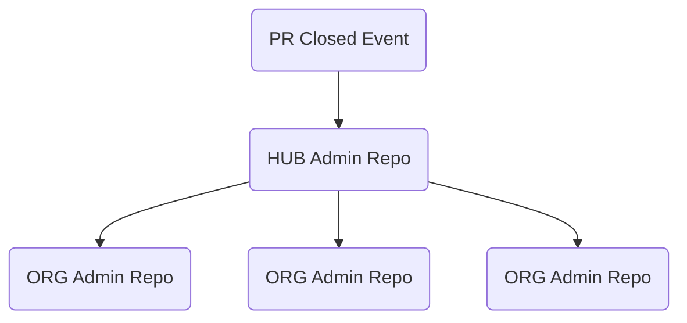

# Safe Settings Organization Sync & Dashboard

 This feature provides a centralized approach to managing the Safe-Settings Admin Repo, allowing Safe-Settings configurations to be sync'd across multiple ORGs.

## Overview

This adds the **hub‑and‑spoke synchronization capability** to Safe Settings.

One central **master admin repository** (the hub) serves as the authoritative source of configuration ('Master' Admin Config Repo) which is automatically propagated to each organization’s **admin repository** (the spokes).

**Note:** When something changes in the 'Master' repo (the hub), only those changed files are copied to each affected ORG’s admin repo, so everything stays in sync.

## Sync Lifecycle (High Level)



## Gettings Started

>**Note:** for the standard setup lets assume that Safe-Settings configuration on the Admin Config Repos (Spokes) are stored in `.github/`

These are the basic steps to setup the Enterprise-Level Safe-Settings, using **Hub-sync** support.

### ✅ Step 1: Register the App
**Register the Safe-Settings App** in your Enterprise (Enterprise App) or in your Organization.

For App "installation tragets" (Where can this GitHub App be installed?)
Choose ***Any account***

### ✅ Step 2: Install the App
**Install the Safe-Settings App** in any Organzation that you would like Safe-Settings to manage.

### ✅ Step 3: Create the 'Org-Level' Safe-Settings Admin Config Repo (Spokes)
Create the Org-Level Repo that is your dedicated Safe-Settings Config Repo and will hold all Safe-Settings configurations for the Org.

### ✅ Step 4: Create the 'Master' Safe-Settings Admin Config Repo (Hub)
Choose any Organization where the Safe-Settings App is installed and create a 'Master' Safe-Settings Admin Config Repo. 

The Repository requires a standard directory structure for storing the config data:
```bash
.github/
└─ safe-settings/
    ├── globals/
    │   └── manifest.yml
    └── organizations/
        ├── org1/
        │   └── ...yml
        └── org2/
            └── ...yml
```

Notes:
- The `manifest.yml` is a required file, that defines rules for syncing **Global** Safe-Settings configurations. We will address the content format later.
- `org1` and `org2` are just examples and should be replaced with the real names of the Orgs that you want to manage with the **Hub-Sync**.

### ✅ Step 5: Configure the 'Master' Safe-Settings Admin Config Repo (Hub)

The **Hub-Sync** feature supports two options
1. **Organization Sync:**
Any settings file in the `organizations/<ORG>` directory will be synced to the specific `<ORG>` (Spoke) Admin config Repo subfolder (eg.: <ORG>/.github/). Only updated files are sync'd to the ORG admin config Repo (spokes).
1. **Global Sync:** Any settings file in the `globals/` directory will be synced to the specific `<ORG>` (Spoke) Admin config Repo subfolder (eg.: <ORG>/.github/).

    :warning: The actual sync operation is based on the rules defined in the `globals/manifest.yml`. The rules provide fine grained control over the sync targets and sync strategy.

These two options only require that you provide the files you would like to sync, in the correct sub-directory.

#### ✅ Step 5.1: Configure the `manifest.yml` in the 'Master' Safe-Settings Admin Config Repo (Hub)

The `manifest.yml` defines the sync rules for global settings distribution.
- Sample `manifest.yml`

  ```
  rules:
    - name: global-defaults
      # specify the target ORG(s)
      targets: 
        - "*"
      files:
        - "*.yml"

      # mergeStrategy: merge | overwrite | preserve
      # --------------------------------------------
      # merge     = use a PR to sync files 
      # overwrite = sync all files to the target ORG(s) (no PR)
      mergeStrategy: merge

    - name: security-policies
      # specify the target ORG(s)
      targets: 
        - "acme-*"
        - "foo-bar"
      files:
        - settings.yml
      mergeStrategy: overwrite
      
      # optional toggle, default true
      # enabled: false 
  ```

### Example Rule Breakdown

```yaml
- name: global-defaults
  targets: 
    - "*"
  files:
    - "*.yml"
  mergeStrategy: merge
```
- **Purpose:** Sync all YAML files to all organizations, merging changes via PR.

```yaml
- name: security-policies
  targets: 
    - "acme-*"
    - "foo-bar"
  files:
    - settings.yml
  mergeStrategy: overwrite
  enabled: false
```

- **Purpose:** Overwrite `settings.yml` in specific organizations, but currently disabled.


### `manifest.yml` Reference

The `manifest.yml` file defines synchronization rules for Safe-Settings hub-and-spoke configuration management. Each rule specifies which organizations and files to target, and how to handle synchronization.

### Top-Level Structure

```yaml
rules:
  - name: <string>
    targets: [<string>, ...]
    files: [<string>, ...]
    mergeStrategy: <merge|overwrite|preserve>
    enabled: <true|false> # optional
    # ...additional fields as needed
```

---

### Elements

#### `rules`
- **Type:** Array of objects
- **Description:** List of synchronization rules. Each rule controls how specific files are synced to target organizations.

#### Rule Object

##### `name`
- **Type:** String
- **Description:** Unique identifier for the rule. Used for reference and logging.
- **Example:** `global-defaults`, `security-policies`

##### `targets`
- **Type:** Array of strings
- **Description:** List of organization names or patterns to apply the rule to.
  - `"*"`: All organizations
  - `"acme-*"`: Organizations with names starting with `acme-`
  - `"foo-bar"`: Specific organization
- **Example:**  
  ```yaml
  targets:
    - "*"
    - "acme-*"
    - "foo-bar"
  ```

##### `files`
- **Type:** Array of strings
- **Description:** File patterns to sync. Supports wildcards.
  - `"*.yml"`: All YAML files
  - `"settings.yml"`: Specific file
- **Example:**  
  ```yaml
  files:
    - "*.yml"
    - "settings.yml"
  ```

##### `mergeStrategy`
- **Type:** String (`merge`, `overwrite`, `preserve`)
- **Description:** Determines how files are synced:
  - `merge`:  use a PR to sync files 
  - `overwrite`: Sync all files, replacing existing ones (direct commit, no PR)
- **Example:**  
  ```yaml
  mergeStrategy: merge
  ```

##### `enabled`
- **Type:** Boolean (optional)
- **Description:** Toggle to enable or disable the rule. Default is `true`.
- **Example:**  
  ```yaml
  enabled: false
  ```

---

### Environment Variables & Inputs Specific to the **Hub-Sync** feature

| Name | Purpose | Default |
|------|---------|---------|
| `SAFE_SETTINGS_HUB_REPO` | Repo for master safe-settings contents | admin-master |
| `SAFE_SETTINGS_HUB_ORG` | Organization that hold the Repo | admin-master-org |
| `SAFE_SETTINGS_HUB_PATH` | source folder | .github/safe-settings  |
| `SAFE_SETTINGS_HUB_DIRECT_PUSH` | Use a PR or direct commit | false |


---
---

## Hub Sync Scenarios

1. Sync the `Hub Admin Repo` changes to a `Safe-Settings Admin Repo` in **the same ORG** as the Hub Admin Repo.

2. Sync the `Hub Admin changes` to a `Safe-Settings Admin Repo` in **a different ORG**. 

3. _`'Global'`_ `Hub Admin Repo` updates. 
Changes will `applied to all Organization`

---

## Safe-Settings Hub API endpoints

### API Endpoints

The following table summarizes the Safe Settings API endpoints:

| Endpoint                                 | Method | Purpose                                              | Example Usage |
|------------------------------------------|--------|------------------------------------------------------|---------------|
| `/api/safe-settings/installation`        | GET    | Organization installation, repo, and sync status      | Fetch org status |
| `/api/safe-settings/hub/content`         | GET    | List hub repo files/directories                      | List hub files |
| `/api/safe-settings/hub/content/*`       | GET    | Fetch specific file or directory from hub repo        | Get file content |
| `/api/safe-settings/hub/import`          | POST   | Import settings from orgs into the hub                | Import org settings |
| `/api/safe-settings/env`                 | GET    | App environment/config variables                      | Get env vars |

**Examples:**
- Fetch org installation status:
  ```http
  GET /api/safe-settings/installation
  ```
- Import settings from orgs:
  ```http
  POST /api/safe-settings/hub/import
  Body: { "orgs": ["org1", "org2"] }
  ```
- List hub repo files:
  ```http
  GET /api/safe-settings/hub/content?ref=main&recursive=true
  ```
- Get environment variables:
  ```http
  GET /api/safe-settings/env
  ```

---