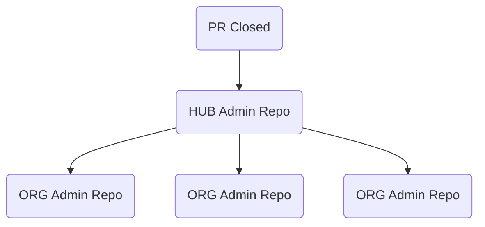

# Safe Settings Organization Sync & Dashboard

 This feature provides a centralized approach to managing the Safe-Settings Admin Repo, allowing Safe-Settings configurations to be sync'd across multiple ORGs.

## Overview

This feature adds a hub‑and‑spoke synchronization capability to Safe Settings.

One central **master admin repository** (the hub) serves as the authoritative source of configuration which is automatically propagated to each organization’s **admin repository** (the spokes).

**Note:** When something changes in the central repo, only those changed files are copied to each affected ORG’s admin repo, so everything stays in sync with little manual work.

## Sync Lifecycle (High Level)

## Environment Variables & Inputs

Environment variables specific to the 'Sync-Feature'

| Name | Purpose | Default |
|------|---------|---------|
| `SAFE_SETTINGS_HUB_REPO` | Repo for master safe-settings contents | admin-master |
| `SAFE_SETTINGS_HUB_ORG` | Organization that hold the Repo | admin-master-org |
| `SAFE_SETTINGS_HUB_PATH` | source folder | .github/safe-settings  |
| `SAFE_SETTINGS_HUB_DIRECT_PUSH` | Use a PR or direct commit | false |

